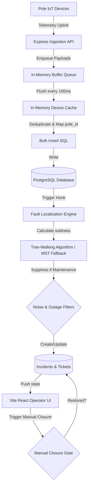

# 🏗️ GridGuard System Architecture

## 1. System Dataflow

---

## 2. Data Sourcing and Ingestion Pipeline
To satisfy high-frequency telemetry loads (500+ messages/sec) without locking our database:
1.  **Ingestion Buffer:** The `POST /api/telemetry` endpoint accepts single payloads or arrays. It pushes them to an in-memory queue and instantly returns `202 ACCEPTED` (sub-millisecond response latency).
2.  **In-Memory Device Cache:** We cache the `device_id -> { pole_id, dt_id, feeder_id }` mapping on backend start. Since the physical layout is static, we avoid querying the database for every single telemetry message.
3.  **Deduplication & Chronological Ordering:** Every 100ms, the queue flushes. We deduplicate logs internally in-memory using `device_id-ts-seq` before pushing them to PostgreSQL in a single multi-row `INSERT ... ON CONFLICT DO NOTHING` query.
4.  **Database Connection Pooling:** We utilize `pg-pool` to manage database connections, eliminating the overhead of opening and closing connections on each database write.

---

## 3. Storage Layer & Network Model

We use a PostgreSQL relational schema optimized for hierarchical traversal:
*   `substations`: Roots of the distribution grid.
*   `feeders`: High-voltage lines branching from substations.
*   `transformers` (DTs): Stepped-down voltage hubs branching from feeders.
*   `poles`: Radial distribution nodes.
    *   `parent_pole_id` (foreign key pointing to another pole) and `seq_on_line` represent the tree hierarchy.
    *   **60% Missing Topology:** For 60% of transformers, `parent_pole_id` and `seq_on_line` are `null` in the database, requiring geometric topology fallback.
*   `telemetry_logs`: Flat table of events (`heartbeat`, `power_lost`, `boot`). Protected by a unique constraint on `(device_id, ts, seq)` ensuring write idempotence.
*   `tickets`: Live incident records tracking localized outages.
*   `active_faults` & `scheduled_outages`: Persistence tables managing active simulations and maintenance windows.

---

## 4. The Fault Localization Engine

Every telemetry write triggers the localization engine for affected transformers.

### A. Graph Construction
For a given Transformer (DT) tree:
*   **Known Topology (40%):** We construct the tree directly using the database `parent_pole_id` relations.
*   **Missing Topology (60%):** We construct a **Minimum Spanning Tree (MST)** using **Prim's Algorithm** with **Haversine Distance** weights (meters) between all poles.
    *   *Mathematical Rationale:* Physical distribution lines are built to minimize cable usage. An MST represents the most logical physical approximation of the grid. The root of the MST is designated as the pole closest to the Transformer.

### B. Tree-Walking & Outage Localization
We perform a post-order Depth-First Search (DFS) traversal on the grid tree:
1.  For each node $X$, we calculate:
    *   $DarkCount(X)$: Number of dark devices in the subtree.
    *   $LiveCount(X)$: Number of live devices in the subtree.
2.  **DT Outage:** If $LiveCount(Root) == 0$ and $DarkCount(Root) \ge 2$, we classify it as a **Transformer Outage** (98% confidence).
3.  **Span Outage:** If a node $X$ has $DarkCount(X) > 1$ and $LiveCount(X) == 0$, but its parent $Y$ (or another branch) is live ($LiveCount(Y) > 0$), we localize a **Span Fault** on the span $Y \rightarrow X$.
4.  **Complexity:** Graph traversal takes $O(V + E)$ time. Inferred MST construction takes $O(V^2)$ where $V \le 50$ poles per transformer. The algorithm runs in sub-millisecond times, well within ingestion latency bounds.

---

## 5. Noise and Outage Filtering

*   **Dead Sensor Filter (False Alarm Suppression):** If a single leaf pole goes dark ($DarkCount(X) == 1$, no children) and its parent node is live, it is classified as a dead sensor or single-pole false alarm. **No ticket is created.**
*   **Scheduled Outage Suppression:** If a transformer, feeder, or pole is within an active maintenance window (`scheduled_outages`), ticket generation is suppressed.
*   **Safety Manual Closure Gate (G4):** An operator cannot manually resolve a ticket if downstream telemetry is still reporting dark states. The backend blocks manual transition to `resolved` and returns a safety protocol breach error.
*   **Auto-Closure Workflow:** When repairs are completed, restored devices broadcast `boot` and `heartbeat` events. The backend automatically transitions the ticket status to `resolved` once all downstream poles return to `live`.

---

## 6. API Surface

| Method | Path | Description | Shape (Request / Response) |
|---|---|---|---|
| `POST` | `/api/telemetry` | Ingest sensor telemetry | `TelemetryPayload \| TelemetryPayload[]` / `202 ACCEPTED` |
| `GET` | `/api/telemetry` | Get 50 latest telemetry logs | None / `TelemetryLog[]` |
| `GET` | `/api/tickets` | Get all incident tickets | None / `Ticket[]` |
| `PATCH`| `/api/tickets/:id`| Update ticket status (G4 check) | `{ status: string }` / `Ticket` |
| `POST` | `/api/simulator/inject` | Inject grid faults | `{ type: 'feeder'\|'dt'\|'span', target_id: string, span_end_pole_id?: string }` / `{ status: 'SUCCESS', fault_id: number }` |
| `POST` | `/api/simulator/clear` | Clear/Repair grid faults | `{ fault_id: number }` / `{ status: 'SUCCESS' }` |
| `GET` | `/api/simulator/state` | Fetch active faults & outages | None / `{ active_faults: [], scheduled_outages: [], dark_poles_count: number }` |
| `POST` | `/api/simulator/outage` | Schedule maintenance outage | `{ type: 'dt'\|'feeder', target_id: string, start_time: string, end_time: string }` / `{ status: 'SUCCESS' }` |
| `GET` | `/api/simulator/assets` | Get all static assets | None / `{ substations: [], feeders: [], transformers: [], poles: [] }` |

---

## 7. AI Dispatcher Feature
*   **Purpose:** Grid operators need immediate natural language descriptions during high-stress outages.
*   **Implementation:** The backend generates an automated incident brief. It outlines:
    *   Outage level (Feeder, Transformer, Span).
    *   Specific localized boundaries (e.g. "Span fault between P-0001-002 and P-0001-003").
    *   Confidence level and topology type (e.g., "Topology inferred via MST").
*   **Cost & Availability:** We use a deterministic rules-based template compiler. It costs **$0** per call, is **100% reliable**, and executes in **0ms** (fully immune to LLM downtime or hallucinations). If an LLM is desired for formatting, it can be called asynchronously with the deterministic template as a fallback.
